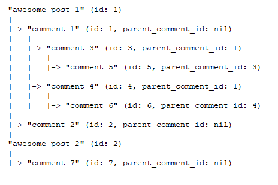

# graphql-app
# Запуск приложения / unit тестов
1. Путь к базе данных сконфигурирован для сборки docker image. Чтобы запустить приложение локально c postgres хранилищем, нужно поднять postgres в докере (запустить сервис db из docker-compose.yml) и использовать для подключения к базе данных URL database_url_local из файла /config/config.yml .

2. unit тесты postgres используют "github.com/testcontainers/testcontainers-go". Чтобы запустить тесты локально, нужно сначала поднять postgres в контейнере (можно использовать сервис db из docker-compose.yml).

# Особенности реализации
1. Часть входящих mutation запросов валидируется на уровне storage. Эти проверки должны быть выполнены в одной транзакции  вместе с запросом на добавление (изменение) записи в базу данных.

TODO: перенести валидацию на сервисный слой; реализовать работу с транзакциями на сервисном слое.

2. При выборке всех комментариев поста элементы сортируются особым образом. 
Например, для такой структуры постов и комментариев:

Выборка всех комментриев поста "awesome post 1" (id: 1) будет в таком порядке:
["comment 1", "comment 3", "comment 5", "comment 4", "comment 6", "comment 2"]
Выборка всех комментриев поста "awesome post 2" (id: 2):
["comment 7"]

Для реализации хранения комментариев в таблице comments добавлено поле parent_id и rank. 
Назначение поля rank описано: https://gist.github.com/codedokode/10539720#4-materialized-path

TODO ? реализовать древовидную структуру комментариев в базе данных с использованием Nested Set - https://www.webscript.ru/stories/04/09/01/8197045
